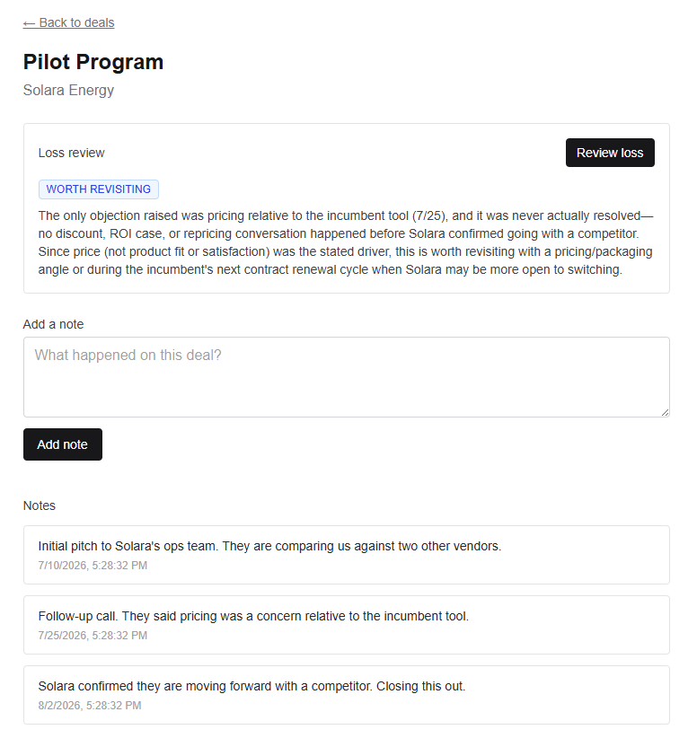
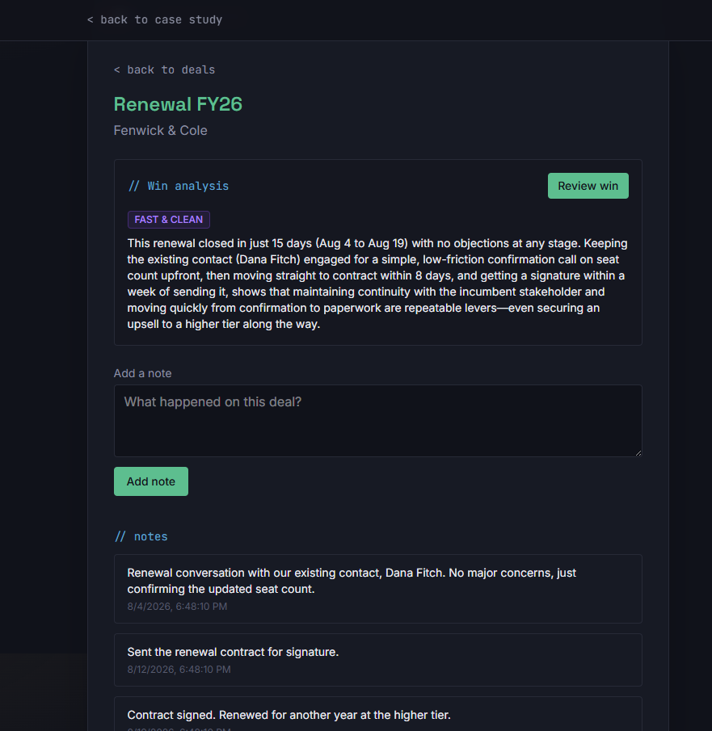

# AI-powered sales intelligence tool

This README describes the project's target/finished state (per the build plan) while development is underway. See [Status](#status) for what's actually live right now.

A focused, single-feature sales intelligence tool. Reps and managers log deal notes over time, and the app flags deals that have gone quiet or lost momentum. It gives a plain-English explanation of *why* it thinks so, not just a summary of the notes.

It's not a CRM clone. It does one thing an off-the-shelf CRM doesn't: reason about momentum across a note history and surface the deals that need attention before they go cold.

[**Live demo →** https://sales-intel-rho.vercel.app/](https://sales-intel-rho.vercel.app/) &nbsp;·&nbsp; Demo login: `demo@meihuizen.ai` / `SI_Demo1234`

---

## Table of contents

- [Why this isn't a chatbot wrapper](#why-this-isnt-a-chatbot-wrapper)
- [Stack](#stack)
- [How it works](#how-it-works)
- [Screenshots](#screenshots)
- [Getting started](#getting-started)
- [Project structure](#project-structure)
- [Status](#status)
- [What I'd build next](#what-id-build-next)
- [License](#license)

---

## Why this isn't a chatbot wrapper

The easy version of this project is "paste your notes into a prompt and print whatever comes back." That's not what this does.

The AI feature takes a deal's *entire* note history, with each note timestamped. It's asked to reason about **momentum**, not to summarize content. It has to weigh things like: how long since the last touch, whether recent notes show forward motion (next steps, dates, commitments) or stalling language (vague follow-ups, no response, pushed timelines), and how that compares to the deal's earlier trajectory. The output is a structured status (`healthy` / `stalling` / `at risk`), a short reasoning string explaining *why*, and two to four next steps written as things you could do this week. The reasoning says what is happening. The next steps say what to do about it. That second half is what separates a judgment tool from a text-in/text-out wrapper.

All of that reasoning happens server-side. The AI provider's API key never reaches the browser, so it can't be lifted from devtools or a network tab.

## Stack

| Layer | Choice | Why |
|---|---|---|
| Framework | **Next.js** (App Router, TypeScript) | Frontend and backend API routes in one project, one deploy target. |
| Database | **Supabase** (Postgres) | Managed Postgres with a generous free tier. Includes auth too, so that's one less service to wire up. |
| Auth | **Supabase Auth** | Email/password + magic link out of the box, instead of hand-rolling session management. |
| AI | **Anthropic API**, called server-side only | Keeps the API key off the client and gives control over cost and rate limits. |
| Styling | **Tailwind CSS** | Fast to build with and easy to keep consistent without a component library. |
| Deploy | **Vercel** | Connects straight to this repo and auto-deploys on push to `main`. |

## How it works

1. Log a deal, then log notes against it over time (calls, emails, meetings).
2. Open the deal and click **Analyze**.
3. A server route pulls the full, timestamped note history and sends it to the model with a prompt built around momentum, not summarization.
4. The model returns a structured status (`healthy` / `stalling` / `at risk`), a short reasoning string, and a bulleted list of next steps, all rendered on the deal page.

For a deal that's already closed, the same button asks a different, status-appropriate question instead of a repeat momentum read. A lost deal gets a post-mortem plus either a re-approach plan or a list of what to do differently next time. A won deal gets a win analysis plus the plays worth repeating in the next deal.

## Screenshots

**Loss review**: for a deal marked lost, the AI runs a post-mortem instead of a momentum read. It either confirms the loss was final, or names the specific unaddressed objection worth revisiting.



**Win analysis**: for a deal marked won, it surfaces what specifically made the deal move fast and what's repeatable in a future deal, instead of a plain "won" badge.



## Getting started

### Environment variables

| Variable | Used for |
|---|---|
| `NEXT_PUBLIC_SUPABASE_URL` | Supabase project URL |
| `NEXT_PUBLIC_SUPABASE_ANON_KEY` | Supabase client (browser-safe) key |
| `SUPABASE_SERVICE_ROLE_KEY` | Server-side Supabase access, never exposed to the client |
| `ANTHROPIC_API_KEY` | AI insight generation, server-side only |

Run `supabase/schema.sql` in the Supabase SQL editor to create the `companies`, `deals`, and `notes` tables before starting the app.

## Project structure

```
sales-intel/
├── app/
│   ├── page.tsx                 # landing/dashboard
│   ├── layout.tsx
│   ├── login/page.tsx
│   ├── deals/
│   │   ├── page.tsx             # deal list
│   │   └── [id]/page.tsx        # deal detail + notes + AI insight
│   └── api/
│       ├── deals/route.ts       # CRUD for deals
│       ├── notes/route.ts       # CRUD for notes
│       └── insight/route.ts     # calls the AI API server-side
├── components/
│   ├── DealCard.tsx
│   ├── NoteForm.tsx
│   └── InsightPanel.tsx
├── lib/
│   ├── supabase.ts              # Supabase client setup
│   ├── ai.ts                    # AI API wrapper + prompt logic
│   └── types.ts
├── supabase/
│   └── schema.sql               # table definitions
├── .env.local                   # secrets, never committed
└── package.json
```

## Status

Actively being built, phase by phase:

- [x] Project scaffold deployed to Vercel
- [x] Database schema (`companies`, `deals`, `notes`)
- [x] Auth (sign up / log in / log out, protected routes)
- [x] Core CRUD for deals and notes
- [x] AI insight feature (stalled-deal detection with reasoning and next steps)
- [x] Seed data + demo polish
- [x] Live demo link and screenshots above

Check back here for updates, or watch the repo for commits. Each commit lands with a working, demoable state rather than partial work.

## What I'd build next

Beyond the MVP above, the natural next steps toward a real product:

- **Multi-tenancy**: data isolation between different companies/orgs using the tool
- **Billing**: Stripe integration for a paid tier
- **Validated demand**: conversations with real sales reps/managers to pressure-test the wedge feature before investing further
- **Distribution**: desktop packaging or App Store listing, once there's a reason to

## License
MIT

